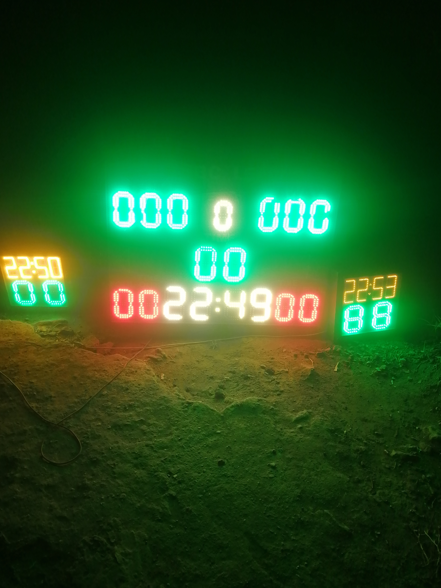

# Basket ball score display
Basketball score display with bright led seven segment displays. 
Node MCU was used as a local server to host the website and control the shift registers that eventually display the scores.  
DS3231 was used as a real time clock module to keep time during operation. 
Images of the display pannel and the website can be found on the images folder 
## Final Results 
1. 

2.

